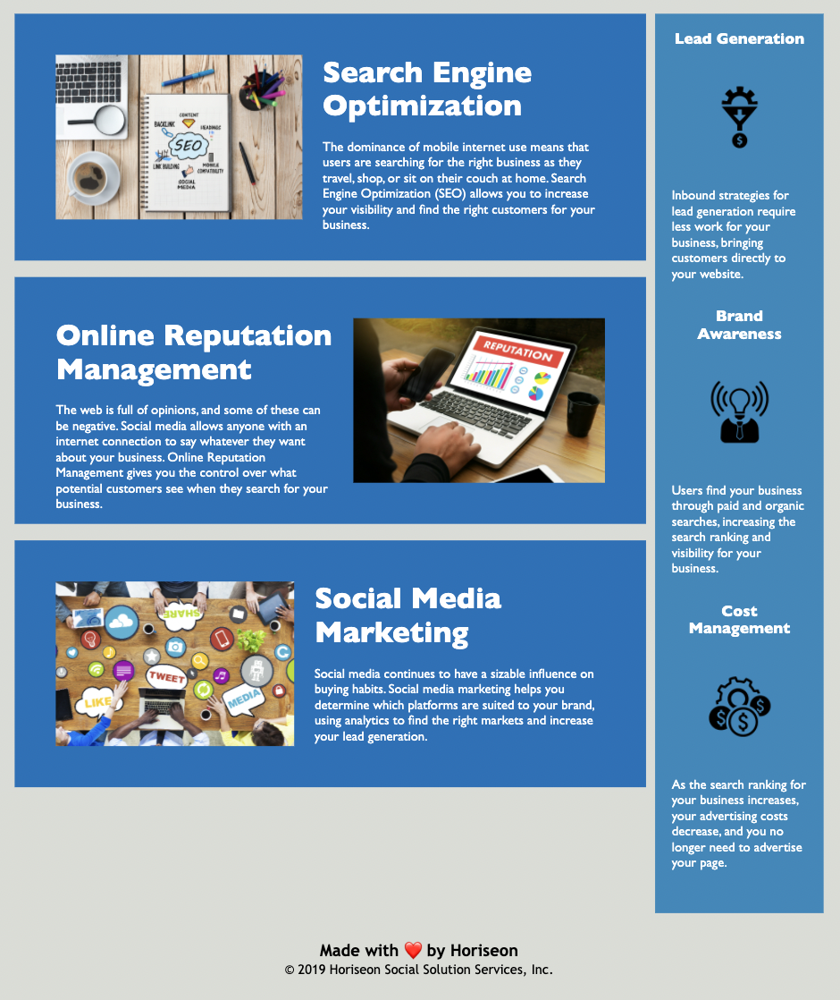

# GT Bootcamp - Code Refractor

## Mitchel Wachtel - mitchel.wachtel@gmail.com

### GT Coding Bootcamp - Homework due 1/3/22 - "Code Refractor"

---

My main motivation for this project was to better understand the semantic structure of HTML and practice using CSS selectors efficiently.

In refractoring this code, I've solved several issues. First, with semantic tags in the HTML, it is easier to work on and for browzers to predict the content of a webpage. I refractored this code so that the HTML is more web accessible for assistive tech and the webpage is more condusive to search engines.

I learned a lot throughout this project. First, I spent a lot of time getting a better understanding of the `<section>` tags vs `<article>` and `<figure>` tags. It was difficult for me to decide when each would be better used. I have realized the importance of accomplishing one task at a time. I was in the middle of making the `
` tags semantic when I realized there was a broken link, and I had to get back on track after dealing with that tangent. I gained good practice in commiting often to git and writing much more concise css. I see the importance in class vs. id. Overall, I am much more confident in writing and reading html and css. In addition, I'm learning the value of a README file and with feedback I'm hoping to soon be able to create professional README files.

My greatest challenge of this project was deciding on the `<section>` tags instead of using any `<article>` or `<figure>` tags. Ultimately, I did not see any of the containers of this page as `<figure>`s because never was an image vital for the user's comprehension of the webpage. Additionally, I did not see any of the containers as `<article>`s because never was there one that contained more than two sentences, so I couldn't reason through any of these being considered an `<article>`.

My next steps would be to add responsive design elements to this webpage because as the width of the page decreases for a tablet and smartphone, the containers react in a way that would be very difficult for the user to have a satisfying experience.

---

### Deployed Site can be found **[here](https://mitchelwachtel.github.io/GTbootcamp-CodeRefractor/)**. 

---

